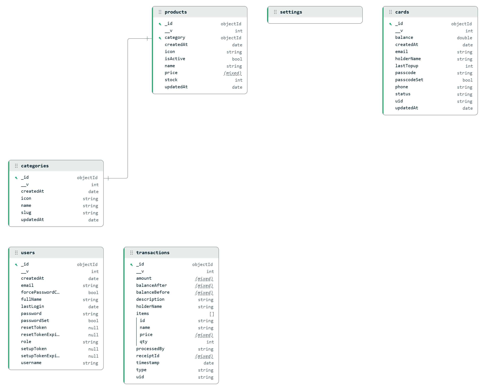

# Database Documentation

This system uses **MongoDB**, a NoSQL database, interfaced via **Mongoose ORM** for flexible yet structured data management. The database is optimized for real-time RFID transactions and concurrent user access.

## Core Models

### 1. User (`User.js`)
Handles authentication and authorization for the dashboard.
- **Fields**: `username`, `email`, `password` (hashed), `role` (agent/salesperson), `passwordSet`, `lastLogin`.
- **Purpose**: Manages access control. Agents can manage users and cards, while salespeople can process marketplace transactions.

### 2. Card (`Card.js`)
Represents physical RFID cards registered in the system.
- **Fields**: `uid` (Unique ID from RFID), `holderName`, `balance`, `passcode` (hashed 6-digit PIN), `status` (active/suspended/blocked).
- **Security**: Payments require a verified passcode if set.

### 3. Transaction (`Transaction.js`)
An immutable audit log of every financial operation.
- **Fields**: `uid`, `type` (topup/debit), `amount`, `balanceBefore`, `balanceAfter`, `receiptId`, `items` (array for purchases).
- **Purpose**: Provides full history for business analytics and user receipts.

### 4. Reservation (`Reservation.js`)
Handles temporary stock locking during the checkout process.
- **Fields**: `productId`, `quantity`, `sessionId`, `expiresAt`.
- **Purpose**: Prevents overselling by locking products for 5 minutes during checkout.

### 5. Settings (`Settings.js`)
Key-value store for system-wide configurations.
- **Fields**: `key`, `value`, `updatedAt`.
- **Purpose**: Allows dynamic updates to system behavior without code changes.

## Optimization & Security

- **Atomic Transactions**: Sensitive operations (like `pay`) use MongoDB Sessions to ensure that balance deduction and transaction logging happen atomically, preventing double-spending.
- **Indexing**: Unique indexes are applied to `uid`, `username`, and `email` for high-performance lookups.
- **Schema Validation**: Mongoose enforces data types and required fields to ensure data integrity across simultaneous connections.

## System Overview

